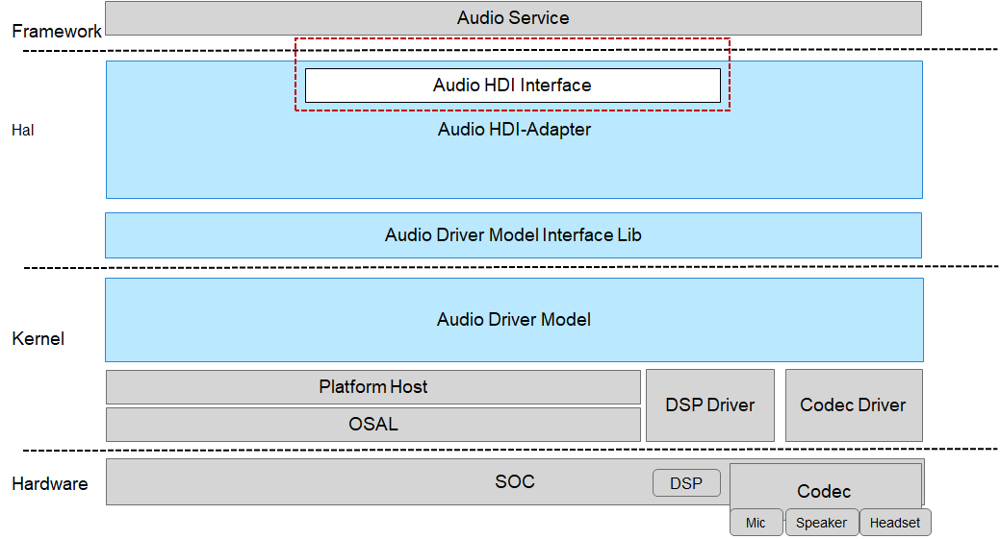

# audio<a name="ZH-CN_TOPIC_0000001078525242"></a>

-   [简介](#section11660541593)
-   [目录](#section161941989596)
    -   [接口说明](#section1551164914237)
    -   [使用说明](#section129654513264)

-   [相关仓](#section1371113476307)

## 简介<a name="section11660541593"></a>

Audio仓下主要包含HDI接口，HDI接口主要用于：

-   管理声卡驱动的加载、卸载
-   创建音频播放、录音对象
-   选择音频场景
-   设置音频属性
-   设置音频音量及增益
-   控制音频播放及录音的启、停等

**图 1**  Audio仓相关模块逻辑视图<a name="fig3672817152110"></a>


## 目录<a name="section161941989596"></a>

Audio仓下源代码目录结构如下所示

```
drivers/peripheral/audio/
└── interfaces         #Audio驱动对外接口存放目录
    └── include        #Audio驱动对北向提供的HDI接口存放目录
```

### 接口说明<a name="section1551164914237"></a>

Audio驱动提供给Audio Service可直接调用的能力接口，主要功能有：加载/卸载音频声卡驱动、创建音频播放/录音对象、启停音频播放/录音、调节音频音量等。

提供的部分接口说明如[表1 Audio HDI接口](#table1513255710559)所示：

**表 1**  Audio HDI接口

<a name="table1513255710559"></a>
<table><thead align="left"><tr id="row171321857155517"><th class="cellrowborder" valign="top" width="10.721072107210723%" id="mcps1.2.4.1.1"><p id="p6132957115511"><a name="p6132957115511"></a><a name="p6132957115511"></a>头文件</p>
</th>
<th class="cellrowborder" valign="top" width="66.36663666366637%" id="mcps1.2.4.1.2"><p id="p14132125715552"><a name="p14132125715552"></a><a name="p14132125715552"></a>接口名称</p>
</th>
<th class="cellrowborder" valign="top" width="22.912291229122914%" id="mcps1.2.4.1.3"><p id="p18132205755516"><a name="p18132205755516"></a><a name="p18132205755516"></a>功能描述</p>
</th>
</tr>
</thead>
<tbody><tr id="row13132357165514"><td class="cellrowborder" rowspan="3" valign="top" width="10.721072107210723%" headers="mcps1.2.4.1.1 "><p id="p15132185775510"><a name="p15132185775510"></a><a name="p15132185775510"></a>audio_manager.h</p>
<p id="p18132157175510"><a name="p18132157175510"></a><a name="p18132157175510"></a></p>
<p id="p2133757135510"><a name="p2133757135510"></a><a name="p2133757135510"></a></p>
</td>
<td class="cellrowborder" valign="top" width="66.36663666366637%" headers="mcps1.2.4.1.2 "><p id="p11132857135517"><a name="p11132857135517"></a><a name="p11132857135517"></a>int32_t (*GetAllAdapters)(struct AudioManager *manager, struct AudioAdapterDescriptor **descs, int32_t *size);</p>
</td>
<td class="cellrowborder" valign="top" width="22.912291229122914%" headers="mcps1.2.4.1.3 "><p id="p213285715558"><a name="p213285715558"></a><a name="p213285715558"></a>获取音频驱动中支持的所有适配器的列表</p>
</td>
</tr>
<tr id="row9132135715515"><td class="cellrowborder" valign="top" headers="mcps1.2.4.1.1 "><p id="p16133957155517"><a name="p16133957155517"></a><a name="p16133957155517"></a>int32_t (*LoadAdapter)(struct AudioManager *manager, const struct AudioAdapterDescriptor *desc, struct AudioAdapter **adapter);</p>
</td>
<td class="cellrowborder" valign="top" headers="mcps1.2.4.1.2 "><p id="p113315745519"><a name="p113315745519"></a><a name="p113315745519"></a>加载一个音频适配器（声卡）的驱动</p>
</td>
</tr>
<tr id="row171330575555"><td class="cellrowborder" valign="top" headers="mcps1.2.4.1.1 "><p id="p913315573557"><a name="p913315573557"></a><a name="p913315573557"></a>void (*UnloadAdapter)(struct AudioManager *manager, struct AudioAdapter *adapter);</p>
</td>
<td class="cellrowborder" valign="top" headers="mcps1.2.4.1.2 "><p id="p1413365765514"><a name="p1413365765514"></a><a name="p1413365765514"></a>卸载一个音频适配器（声卡）的驱动</p>
</td>
</tr>
<tr id="row1513316577554"><td class="cellrowborder" rowspan="6" valign="top" width="10.721072107210723%" headers="mcps1.2.4.1.1 "><p id="p15133657185517"><a name="p15133657185517"></a><a name="p15133657185517"></a>audio_adapter.h</p>
<p id="p1513315717555"><a name="p1513315717555"></a><a name="p1513315717555"></a></p>
<p id="p81331057125513"><a name="p81331057125513"></a><a name="p81331057125513"></a></p>
<p id="p18703206155812"><a name="p18703206155812"></a><a name="p18703206155812"></a></p>
<p id="p17186692581"><a name="p17186692581"></a><a name="p17186692581"></a></p>
<p id="p28322099581"><a name="p28322099581"></a><a name="p28322099581"></a></p>
</td>
<td class="cellrowborder" valign="top" width="66.36663666366637%" headers="mcps1.2.4.1.2 "><p id="p1213365714550"><a name="p1213365714550"></a><a name="p1213365714550"></a>int32_t (*InitAllPorts)(struct AudioAdapter *adapter);</p>
</td>
<td class="cellrowborder" valign="top" width="22.912291229122914%" headers="mcps1.2.4.1.3 "><p id="p201331557185512"><a name="p201331557185512"></a><a name="p201331557185512"></a>初始化一个音频适配器所有的端口驱动</p>
</td>
</tr>
<tr id="row171331657185514"><td class="cellrowborder" valign="top" headers="mcps1.2.4.1.1 "><p id="p913305715553"><a name="p913305715553"></a><a name="p913305715553"></a>int32_t (*CreateRender)(struct AudioAdapter *adapter, const struct AudioDeviceDescriptor *desc, const struct AudioSampleAttributes *attrs, struct AudioRender **render);</p>
</td>
<td class="cellrowborder" valign="top" headers="mcps1.2.4.1.2 "><p id="p161332570553"><a name="p161332570553"></a><a name="p161332570553"></a>创建一个音频播放（render）接口的对象</p>
</td>
</tr>
<tr id="row41331557165518"><td class="cellrowborder" valign="top" headers="mcps1.2.4.1.1 "><p id="p6133145713559"><a name="p6133145713559"></a><a name="p6133145713559"></a>int32_t (*DestroyRender)(struct AudioAdapter *adapter, struct AudioRender *render);</p>
</td>
<td class="cellrowborder" valign="top" headers="mcps1.2.4.1.2 "><p id="p131331557175510"><a name="p131331557175510"></a><a name="p131331557175510"></a>销毁一个音频录音（capture）接口的对象</p>
</td>
</tr>
<tr id="row77021769584"><td class="cellrowborder" valign="top" headers="mcps1.2.4.1.1 "><p id="p77031566584"><a name="p77031566584"></a><a name="p77031566584"></a>int32_t (*GetPortCapability)(struct AudioAdapter *adapter, const struct AudioPort *port, struct AudioPortCapability *capability);</p>
</td>
<td class="cellrowborder" valign="top" headers="mcps1.2.4.1.2 "><p id="p1470315695811"><a name="p1470315695811"></a><a name="p1470315695811"></a>获取一个音频适配器的端口驱动的能力集</p>
</td>
</tr>
<tr id="row71857914585"><td class="cellrowborder" valign="top" headers="mcps1.2.4.1.1 "><p id="p1318619155811"><a name="p1318619155811"></a><a name="p1318619155811"></a>int32_t (*SetPassthroughMode)(struct AudioAdapter *adapter, const struct AudioPort *port, enum AudioPortPassthroughMode mode);</p>
</td>
<td class="cellrowborder" valign="top" headers="mcps1.2.4.1.2 "><p id="p1186597589"><a name="p1186597589"></a><a name="p1186597589"></a>设置音频端口驱动的数据透传模式</p>
</td>
</tr>
<tr id="row18831119115815"><td class="cellrowborder" valign="top" headers="mcps1.2.4.1.1 "><p id="p48323975814"><a name="p48323975814"></a><a name="p48323975814"></a>int32_t (*GetPassthroughMode)(struct AudioAdapter *adapter, const struct AudioPort *port, enum AudioPortPassthroughMode *mode);</p>
</td>
<td class="cellrowborder" valign="top" headers="mcps1.2.4.1.2 "><p id="p15832129135813"><a name="p15832129135813"></a><a name="p15832129135813"></a>获取音频端口驱动的数据透传模式</p>
</td>
</tr>
<tr id="row1452521025813"><td class="cellrowborder" rowspan="8" valign="top" width="10.721072107210723%" headers="mcps1.2.4.1.1 "><p id="p12525910165811"><a name="p12525910165811"></a><a name="p12525910165811"></a>audio_render.h</p>
<p id="p1929018168192"><a name="p1929018168192"></a><a name="p1929018168192"></a></p>
<p id="p99515179192"><a name="p99515179192"></a><a name="p99515179192"></a></p>
<p id="p11331918201913"><a name="p11331918201913"></a><a name="p11331918201913"></a></p>
<p id="p209341981918"><a name="p209341981918"></a><a name="p209341981918"></a></p>
<p id="p1996019191197"><a name="p1996019191197"></a><a name="p1996019191197"></a></p>
<p id="p2812720131919"><a name="p2812720131919"></a><a name="p2812720131919"></a></p>
<p id="p942322013262"><a name="p942322013262"></a><a name="p942322013262"></a></p>
</td>
<td class="cellrowborder" valign="top" width="66.36663666366637%" headers="mcps1.2.4.1.2 "><p id="p105259109581"><a name="p105259109581"></a><a name="p105259109581"></a>int32_t (*RenderFrame)(struct AudioRender *render, const void *frame, uint64_t requestBytes, uint64_t *replyBytes);</p>
</td>
<td class="cellrowborder" valign="top" width="22.912291229122914%" headers="mcps1.2.4.1.3 "><p id="p752531095814"><a name="p752531095814"></a><a name="p752531095814"></a>往音频驱动中播放（render）一帧输出数据（放音，音频下行数据）</p>
</td>
</tr>
<tr id="row172902161193"><td class="cellrowborder" valign="top" headers="mcps1.2.4.1.1 "><p id="p16290141681918"><a name="p16290141681918"></a><a name="p16290141681918"></a>int32_t (*GetRenderPosition)(struct AudioRender *render, uint64_t *frames, struct AudioTimeStamp *time);</p>
</td>
<td class="cellrowborder" valign="top" headers="mcps1.2.4.1.2 "><p id="p1929141611198"><a name="p1929141611198"></a><a name="p1929141611198"></a>获取音频输出帧数的上一次计数</p>
</td>
</tr>
<tr id="row1948179195"><td class="cellrowborder" valign="top" headers="mcps1.2.4.1.1 "><p id="p1395181710193"><a name="p1395181710193"></a><a name="p1395181710193"></a>int32_t (*SetRenderSpeed)(struct AudioRender *render, float speed);</p>
</td>
<td class="cellrowborder" valign="top" headers="mcps1.2.4.1.2 "><p id="p169531741912"><a name="p169531741912"></a><a name="p169531741912"></a>设置音频的播放速度</p>
</td>
</tr>
<tr id="row1331121813197"><td class="cellrowborder" valign="top" headers="mcps1.2.4.1.1 "><p id="p533121871912"><a name="p533121871912"></a><a name="p533121871912"></a>int32_t (*GetRenderSpeed)(struct AudioRender *render, float *speed);</p>
</td>
<td class="cellrowborder" valign="top" headers="mcps1.2.4.1.2 "><p id="p4331131817195"><a name="p4331131817195"></a><a name="p4331131817195"></a>获取音频当前的播放速度</p>
</td>
</tr>
<tr id="row1393181951920"><td class="cellrowborder" valign="top" headers="mcps1.2.4.1.1 "><p id="p79410191191"><a name="p79410191191"></a><a name="p79410191191"></a>int32_t (*SetChannelMode)(struct AudioRender *render, enum AudioChannelMode mode);</p>
</td>
<td class="cellrowborder" valign="top" headers="mcps1.2.4.1.2 "><p id="p17948193197"><a name="p17948193197"></a><a name="p17948193197"></a>设置音频播放的通道模式</p>
</td>
</tr>
<tr id="row8960121911198"><td class="cellrowborder" valign="top" headers="mcps1.2.4.1.1 "><p id="p1896011190199"><a name="p1896011190199"></a><a name="p1896011190199"></a>int32_t (*GetRenderSpeed)(struct AudioRender *render, float *speed);</p>
</td>
<td class="cellrowborder" valign="top" headers="mcps1.2.4.1.2 "><p id="p209616197191"><a name="p209616197191"></a><a name="p209616197191"></a>获取音频当前的播放速度</p>
</td>
</tr>
<tr id="row10812112081919"><td class="cellrowborder" valign="top" headers="mcps1.2.4.1.1 "><p id="p12812520151919"><a name="p12812520151919"></a><a name="p12812520151919"></a>int32_t (*SetChannelMode)(struct AudioRender *render, enum AudioChannelMode mode);</p>
</td>
<td class="cellrowborder" valign="top" headers="mcps1.2.4.1.2 "><p id="p38125205195"><a name="p38125205195"></a><a name="p38125205195"></a>设置音频播放的通道模式</p>
</td>
</tr>
<tr id="row12422102092613"><td class="cellrowborder" valign="top" headers="mcps1.2.4.1.1 "><p id="p194231720102610"><a name="p194231720102610"></a><a name="p194231720102610"></a>int32_t (*GetChannelMode)(struct AudioRender *render, enum AudioChannelMode *mode);</p>
</td>
<td class="cellrowborder" valign="top" headers="mcps1.2.4.1.2 "><p id="p342315202267"><a name="p342315202267"></a><a name="p342315202267"></a>获取音频播放当前的通道模式</p>
</td>
</tr>
</tbody>
</table>

### 使用说明<a name="section129654513264"></a>

该仓核心功能包括两个方面：

1.  提供Audio HDI接口供北向音频服务调用，实现音频服务的基本功能。
2.  作为标准南向接口，保证南向OEM产商实现HDI-adapter的规范性，保证生态良性演进。

具体接口调用及实现，以接口注释为准。

## 相关仓<a name="section1371113476307"></a>

[驱动子系统](https://gitee.com/openharmony/docs/blob/master/zh-cn/readme/%E9%A9%B1%E5%8A%A8%E5%AD%90%E7%B3%BB%E7%BB%9F.md)

[drivers\_framework](https://gitee.com/openharmony/drivers_framework/blob/master/README_zh.md)

[drivers\_adapter](https://gitee.com/openharmony/drivers_adapter/blob/master/README_zh.md)

[drivers\_adapter\_khdf\_linux](https://gitee.com/openharmony/drivers_adapter_khdf_linux/blob/master/README_zh.md)

drivers\_peripheral

